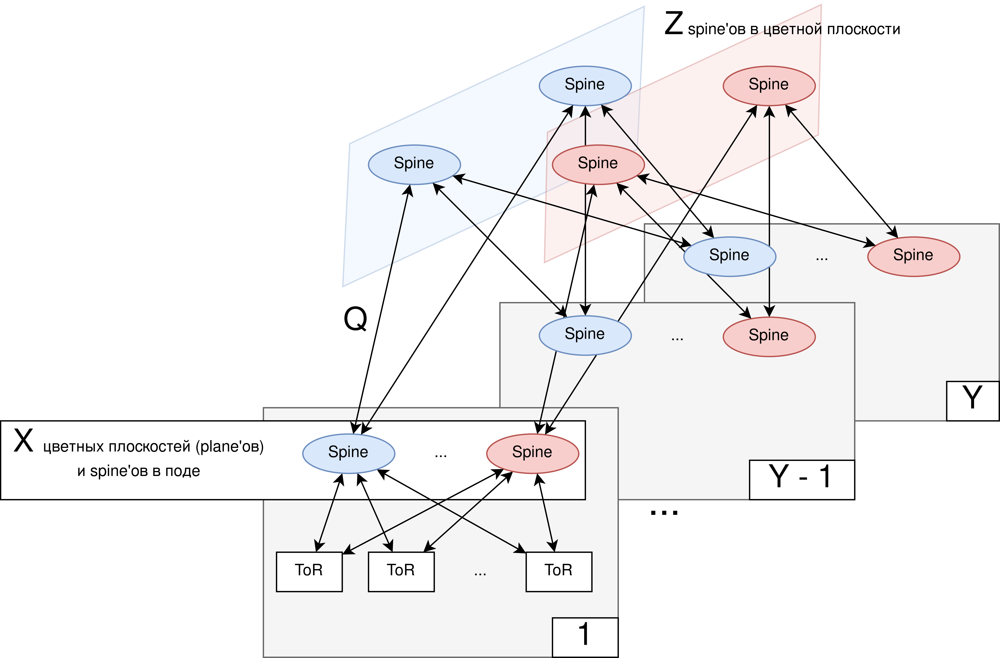

# Отчет по лабораторной работе №3

## Параметры скрипта

* количество клиентских портов (500, 1000, 1500, 2000, 3000, 4000, 5000, 8000, 10000)
* коэффициенты переподписки (1:1, 1:2, 1:3, 1:4 -- в конфиге задается как целое число, знаменатель отношения)
* ToR (leaf) downlinks 48 (10 или 25G - 2 варианта) -- 8 100G (единственный вариант)
* Варианты Spine (32x 100G или 64x 100G)
* Условная стоимость (с возможностью изменения):
    * 100G трансивера в 1000 у.е. на каждый link 100G по 2 штуки
    * стоимость TOR 100000 у.е.
    * Spine 32 порта - 20000 у.е.
    * Spine 64 порта - 35000 у.е.

## Нюансы

способ в лоб:
1. число tor'ов исходя из числа клиентов и портов
2. число spine'ов первого уровня как число uplink'ов от ToR'ов
3. число pod'ов как math.ceil(число spine'ов первого уровня)
4. число spine'ов 2ого уровня как число spine'ов 1ого уровня per pod, умноженное на число pod'ов (в том числе в последнем pod аналогично, хотя потенциально избыточно)

ограничение:
1. чтобы не было единой точки отказа, нужно гарантировать, что при отказе 1 spine на любом уровне сеть не разделялась (в связи с этим везде (на 1 и 2 уровне) будет по 2 spine минимум)

возможные оптимизации:
1. [можно включить] в spine 2ого уровня можно использовать в 2 раза меньше штук, так как там все порты используются для соединения со spine'ами 2ого уровня, при том, что у spine 1 уровня половина портов используется для соединения с tor'ами)
2. [не стал делать, потому что из-за специфики последнего pod'а данная схема выглядит сложнее для конфигурирования и менее "равновесной" - проще спроектировать симметричную схему с возможностью подключить tor'ы в будущем в последний pod] в последнем pod (+ аналогично в одноуровневой схеме, см. дальше) гипотетически может быть меньше tor'ов (например, для 33 tor'ов и 16 per pod в последнем pod'е будет 1 tor), тогда при, например, 4 uplink'ах => 4 spine'ах 1 уровня на каждый pod (16 портов вниз, 16 вверх x4 == 64 вниз, 64 вверх), в последнем pod будет всего 4 порта вниз => для еще 64 портов (суммарно 68) вверх хватит 3 (= math.ceil(68 / 32)) spine'ов первого уровня

## Топологии

возможно 2 случая

### Одноуровневая схема

в этой схеме число tor'ов рассчитывается из числа клиентских портов и должно быть <= числа портов spine'ов 1 уровня. число этих spine'ов рассчитывается исходя из числа uplink'ов от tor'ов (гипотетически в качестве оптимизации можно использовать меньше spine'ов (\*)). каждый tor подключен к каждому spine'у.

(\*) - например, если у нас 16 tor'ов, у spine'ов при этом 32 порта -- тогда можно использовать 2 линка между каждыми spine'ами и tor'ами и сделать uplink // 2 spine'ов, но такая схема потребует "изменений" (придется отключать 1 из link'ов и использовать его в новом spine'e) при необходимости наращивания, что может быть не очень удобно (при этом схема с изначальной переподпиской подразумевает в дальнейшем "добавление" spine'ов, но не изменение текущих, поэтому я считаю ее более предпочтительной и не учитываю подобную оптимизацию)

как выглядит:


### Двухуровневая схема

2 уровневая схема на уровне pod'ов выглядит как одноуровневая, при этом на уровне plane'ов число spine'ов 2ого уровня Z вычисляется как минимальное значение, подходящее по 2 условиям (+ условие по отсутствию единой точки отказа => Z > 1):
1. `Z = 2^n` (является степенью 2 для равномерной пропускной способности между pod'ами)
2. `Z >= X // 2` (где X - число pod'ов == число spine'ов 1ого уровня в plane'e)

как выглядит:



### Как скрипт будет отражать топологию

скрипт будет выводить параметры топологии:
1. число уровней (1 или 2)
2. число tor'ов в pod'ах (+ отдельное число для последнего пода, может отличаться для 2уровневой схемы)
3. число spine'ов в pod'ах (X - оно же -- фактически число plane'ов)
4. число pod'ов (Y)
5. число spine'ов 2 уровня в plane'ах (Z)

уточнение схемы:
1. в рамках pod'а все tor'ы соединены со всеми spine'ами 1ого уровня 1 link'ом
2. число link'ов от spine1 до spine2 - `Q = uplink_ports1 / Z`

## Результаты расчетов для различных конфигураций

### Запуск скрипта и представление результата

результаты были вычислены для нужных параметров скриптом вида:
```bash
for o in 1 2 3 4; do for i in 500 1000 1500 2000 3000 4000 5000 8000 10000; do echo EXEC FOR clients=$i oversub=1:$o >> unsafe10.txt; python3 calculate.py -p $i -o $o >> unsafe10.txt; done; done
```

скрипт запускался 4 раза, в рамках запусков менялись значения `safe` (true, false - можно ли при возможности (если хватает bandwidth) использовать 1 spine на любом из уровне) + `client_ports.bandwidth` (10, 25) (все комбинации)

в результате такого перебора были построены графики для различных `client_ports.bandwidth` (при этом на графиках перебирались все комбинации spine'ов (32 порта за 20'000 и 64 порта за 35'000, в легенде `p`), безопасности (`s`) и коэффициента переподписки (`o` в легенде))

### График для 10G


### График для 25G


### Выводы

сравнение наборов графиков (для сравнения 10G и 25G портов):

* видно, что паттерны роста одинаковые, просто на группе 25G масштаб примерно в 2 раза больше - это понятно, с учетом необходимости поддержания пропускной способности в 2.5 раза большей (при этом отношение не 2.5, потому что наиболее дорогое устройство - ToR, отношение стремится к этому значению)

дальнейший анализ, с учетом симметричных зависимостей может проводиться по 1 из наборов:

* влияние параметра `s` таково:
  * в некоторых конфигурациях (переподписка 3-4 в особенности) дает заметное преимущество за счет сокращения числа `spine1` при любых значениях;
  * а вот для `spine2` небезопасная конфигурация в какой-то момент перестает давать преимущество и сливается с конфигурацией небезопасной - потому что с какого-то момента (от 3000 до 5000 клиентов, отчетлива видна ступень на графике - одна из ступеней происходит как раз по причине этого перехода) невозможно использовать 1 `spine2` и в обеих конфигурациях одинаковая топология;
* влияние параметра `p`  имеет более интересный характер:
  * при небольшом количестве клиентов использовать spine'ы с большим числом портов невыгодно - они не используются;
  * затем в какой-то момент невыгодно использовать конфигурацию с меньшим числом портов - она раньше вынуждает переходить на 2уровневую схему (одна из ступеней на графике);
  * затем в момент перехода конфигурации с большим числом портов в spine'ах на 2 уровня становится невыгодно использовать ее;
  * по мере увеличения числа подов в какой-то момент конфигурация с бОльшим числом портов становится выгоднее (после всех ступеней ее рост более медленный и линейный на некотором участке).
* влияние параметра `o` однозначно - для больших значений `o` (коэффициент переподписки `1:o`) строить сеть дешевле, при этом переподписка просто напрямую влияет на число uplink'ов => spine'ов в поде, в связи с этим такая зависимость; при этом можно заметить, что для значений 3, 4 в схеме 10G получаются одинаковые значения uplink (1 при небезопасной и 2 при безопасной схемах) и как следствие - одинаковые графики.
